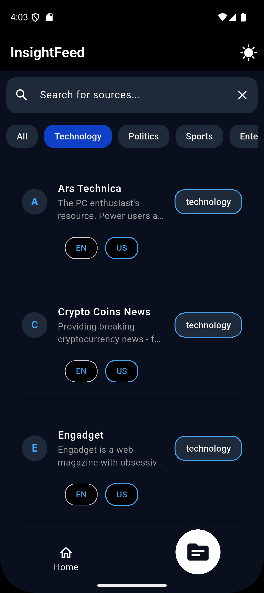
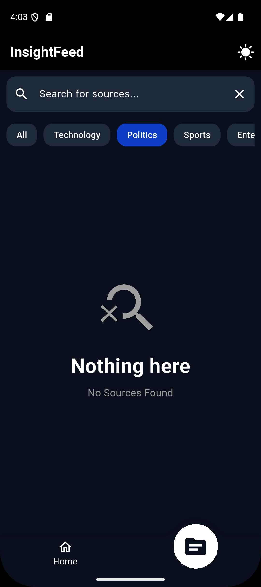

## 🗞 News App

 

---

## Table of Contents

* [App Overview](#app-overview)
* [Main Features](#main-features)
* [App Preview](#app-preview)
* [📸 Extra Screens](#-extra-screens)
* [🛠 Tech Stack](#-tech-stack)
* [Project Structure (key files)](#project-structure-key-files)
* [📦 Installation](#-installation)
* [Future Enhancements](#future-enhancements)
* [Notes](#notes)

---

## App Overview

> **News App** is a modern Flutter application that delivers the latest headlines and top stories from around the world.  
> The app focuses on simplicity, speed, and clean UI — featuring categorized news, trending topics, and news sources, all powered by the **NewsAPI**.

The app is built with **MVVM architecture**, **BLoC (Cubit)** for state management, and integrates real-world API data using **Dio**.

---

## Main Features

### 🏠 Home Screen

* Displays **Trending News**, **Search**, **All News**, and **Categories**.
* Each category shows related news fetched via the API.
* Detailed view for each news article.

---

### 📰 Sources Screen

* View all available news sources.
* Filter and search by source or category.
* Browse articles published by a selected source.

---

## App Preview

|               Home                |             Categories              |             Home Search              |
| :-----------------------------------: | :-------------------------------------: | :----------------------------------: |
|  |  |  |

|             Sources              |             Sources Categories             |             Sources Search             |
| :-------------------------------------------: | :---------------------------------: | :-----------------------------------: |
|  |  |  |

---

## 📸 Extra Screens

|             No Source             |             No News             |             Category News Dark             |
| :-----------------------------------------: | :---------------------------------: | 
|  |  | 

---

## 🛠 Tech Stack

* 
* 
* **Architecture:** MVVM Architecture  
* **State Management:** BLoC / Cubit  
* **Networking:** Dio (^5.9.0)  
* **UI Components:** Convex Bottom Bar (^3.2.0)  
* **API Source:** [NewsAPI.org](https://newsapi.org/)  
* **Storage:** Shared Preferences (for caching data if needed)  

---

## Project Structure (key files)

The app follows the **Clean MVVM Architecture** pattern for scalability and separation of concerns.

```

├── core/
│ ├── shared_widgets/
│ │ ├── category_section.dart
│ │ ├── error_widget.dart
│ │ ├── loading_indicator_widget.dart
│ │ ├── my_app_bar.dart
│ │ └── no_items_found.dart
│ └── utils/
│ └── app_colors.dart
├── features/
│ ├── home/
│ │ ├── data/
│ │ │ ├── data_source/
│ │ │ └── models/
│ │ └── presentation/
│ │ ├── cubit/
│ │ ├── screens/
│ │ └── widgets/
│ └── source/
│ ├── data/
│ │ ├── data_source/
│ │ └── models/
│ └── presentation/
│ ├── cubit/
│ ├── screens/
│ └── widgets/
├── main.dart
└── main_view.dart
```

* **Cubit** for state management  
* **Dio** for HTTP requests  
* **ConvexAppBar** for bottom navigation  
---

## 📦 Installation

### 1. Clone the repository

```bash
git clone https://github.com/KarimTamer74/nti---news_app
cd nti---news_app
```

### 2. Install dependencies

```bash
flutter pub get
```

### 3. Run the app

```bash
flutter run
```
---

Future Enhancements

Add Favorites/Bookmarks for saved articles.

Implement Profile & Settings screen.

Add Dark/Light Theming switch.

Integrate Localization (AR/EN) support.

Add Offline caching for reading without internet.

Notes

API configuration and network layer are located in:
lib/features/*/data/api_service/api_services.dart

Uses NewsAPI.org
 for real-time news data.

All screenshots are from the Dark Mode version, stored in app_shots/.

Bottom navigation is implemented using Convex Bottom Bar with two main tabs:
Home and Sources.

Happy coding! 📰
Contributions and PRs are always welcome 🤝
